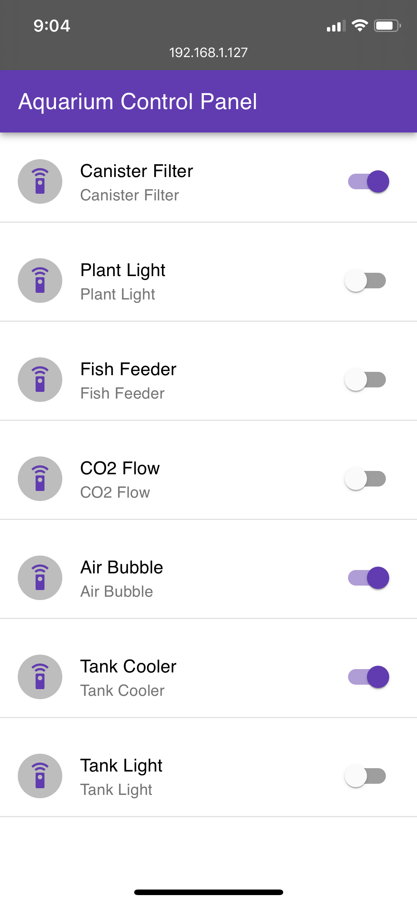

# Aquarium Control using Raspberry Pi

A small hobby project to control all tech used in my aquarium tank. This project uses Raspberry Pi 3 B+ to control C02 flow, Lights, Filter and Cooler. The objective of this project is to fully control an aquarium fish tank remotely.



## Getting Started

### Prerequisites

GPIO and other dependant libraries are mostly preinstalled in Raspberry Pi. So you can simply run the python script as a service or manually

### Installing

Create a service to start the python script and keep it alive always.

```
sudo nano /lib/systemd/system/aquariumctl.service
```

and paste the content below.

```
[Unit]
Description=Aquarium Control
Wants=network-online.target
After=network-online.target

[Service]
Type=simple
User=pi
WorkingDirectory=/home/pi/Documents/AquariumControl/
ExecStart=/usr/bin/python3 aquariumctl.py
Restart=on-abort

[Install]
WantedBy=multi-user.target
```

And use the below commands to set proper execution permission.

```
sudo chmod 644 /lib/systemd/system/aquariumctl.service
chmod +x /home/pi/Documents/aquariumctl.py
```

To start the service, use the below commands.

```
sudo systemctl daemon-reload
sudo systemctl enable aquariumctl.service
sudo systemctl start aquariumctl.service
```

## Configuration

The configurations are all given in the config.json file. This json file has an array of controls to be active in a specific duration.

## Authors

* **Harishankar Narayanan** - [Codetiger](https://github.com/codetiger)

See also the list of [contributors](https://github.com/your/project/contributors) who participated in this project.

## License

This project is licensed under the MIT License - see the [LICENSE](LICENSE) file for details
